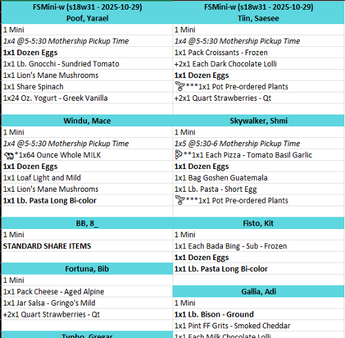
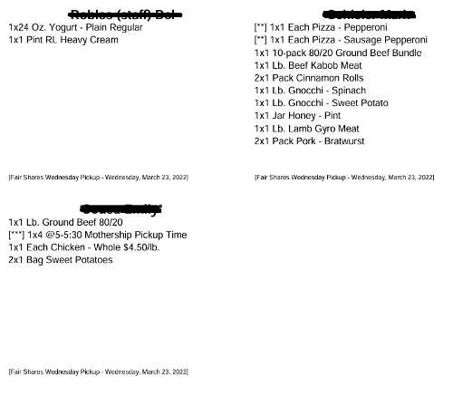
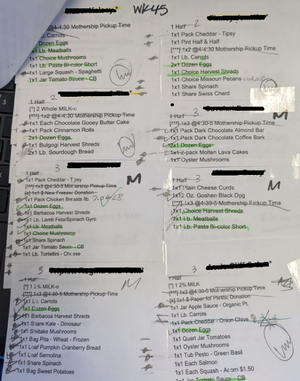

# FS_P003_Customer_Order_List
After members have made their orders, the Fair Shares team has only a few hours before shares have to start to leave our store. This dashboard takes the member order data, transforms and cleans the data set for a consistent and optimized printable output. The owners originally cut and paste member orders together for staff to fill orders. This dashboard eliminates that manual labor for a more streamlined out. 

Below is a snapshot of what that output looks like in this dashboard...

Here is how Farmigo outputs this information...

Here is what staff used to use after they cut and taped the Farmigo orders together. This file is after team members have filled orders so that is what the marks to left and right of each item are for. Showing items have been filled or not.

## Requirements
1. Create a tool that supports customization and automated transformation of customer orders each week
2. Arrange customer orders by Share Group, Pickup Time and Customer Name (Last, First Name)
3. Color / mark Share Groups to easily distinguish between each on different pages
4. Utilize “Default” Share List to highlight members whose shares did not change
5. Allow FS employees ability to dynamically highlight / mark (with emojis) specific item fields of interest (either with an exact match or wildcard match on item name)
6. Implement automatic delete list (items we continuously don’t want to print)
7. Export button should be available to download resulting XLSX file to be able to print (reducing need to manually cut / paste member orders)
8. File output will maximize space as best as possible (multiple columns and members per page to save on printing)

[Google Slides Documentation](https://docs.google.com/presentation/d/1Fmhsmj9le8CtL9Lt84hkOAS5AwI2e_iC1vD4aae-IpI/edit#slide=id.g11337c7c886_0_123)
